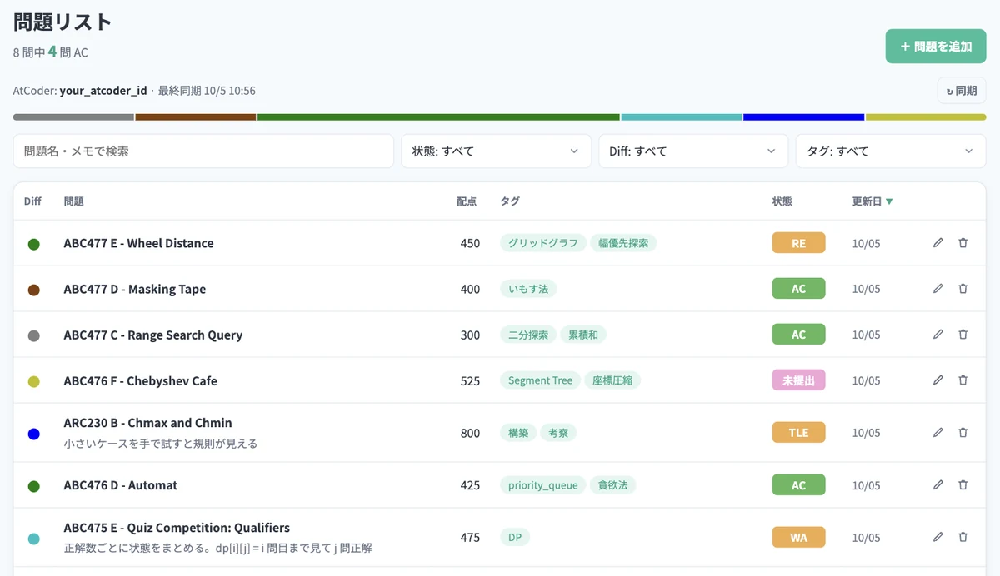

  

<h1 align="center">AtCoder List</h1>

  AtCoder の「解きたい問題」「復習したい問題」をストックしておける問題管理ツールです。

  <a href="https://atcoder-list.ryusuke920.workers.dev"><strong>AtCoder List へ行く</strong></a>
  ・
  <a href="https://atcoder-list.ryusuke920.workers.dev/guide">使い方</a>

## できること

- **コンテストを選ぶだけで問題を追加**できます。コンテスト名や ID を打つと候補が出て、問題を選ぶと URL・問題名・配点が入ります
- **AtCoder ID を登録すると、AC / WA / 未提出 などの状態が自分の提出結果から自動で入ります**
- Difficulty の色・アルゴリズムのタグ・メモで整理して、検索・絞り込み・並び替えができます
- スマホでも使えます

詳しくは [使い方ページ](https://atcoder-list.ryusuke920.workers.dev/guide) をご覧ください。

## 使用方法

1. 新規登録してアカウントを作成します（このアプリ用のユーザー名とパスワードです。AtCoder のパスワードは使いません）
2. 表示される「復旧コード」を控えておきます（パスワードを忘れたときに使います）
3. 右上の「設定」から AtCoder ID を登録します
4. 「＋ 問題を追加」からコンテストと問題を選んで追加します
5. 問題名をクリックすると AtCoder の問題ページに移動できます
6. どんどん問題を溜めていきましょう！！

## 作成のきっかけ

競プロerは問題を溜め込む方が多くいるという話を聞き、自分用の貯蔵庫みたいなものを作れれば良いなと思い作成しました。

2021 年に Heroku で公開していましたが、Heroku の無料プランの終了とともに止まっていたため、2026 年に作り直しました（旧版のコードは [legacy ブランチ](https://github.com/ryusuke920/AtCoderList/tree/legacy) に残しています）。

## 技術スタック

| 内容 | 技術スタック |
|:--:|:--:|
| 使用言語 | TypeScript |
| フロントエンド | React, Vite |
| バックエンド | Hono |
| データベース | Cloudflare D1 (SQLite) |
| サーバー | Cloudflare Workers |

開発者向けの詳しい構成は [docs/development.md](docs/development.md) にまとめています。

## 謝辞

提出結果からの状態の自動更新には、[kenkoooo](https://github.com/kenkoooo) さんが公開している [AtCoder Problems](https://github.com/kenkoooo/AtCoderProblems) の [API](https://github.com/kenkoooo/AtCoderProblems/blob/master/doc/api.md) を利用させていただいています。ありがとうございます。

問題の情報は [AtCoder](https://atcoder.jp) のものです。AtCoder List は個人が運営する非公式ツールで、AtCoder 株式会社とは関係ありません。

## 開発体制

開発者: [ryusuke920](https://twitter.com/ryusuke__h)

### 旧版（2021）

制作期間: 2021/08/31 - 2021/09/26

アイコン作成: [Harry1206](https://github.com/Harrry1206)

CTF: [MtSaka](https://twitter.com/mt_saka), [おばけです](https://twitter.com/OBAKE_DESUYONE)

デバッグ協力者: [mink_](https://twitter.com/mink1618033), [itacha](https://twitter.com/itachakqr), [Nyamau39](https://twitter.com/mijinco2480), [みゅれ.i.am](https://twitter.com/not_mymyuray)

色々助けてくれた方: [mag](https://twitter.com/magurofIy)

## その他

何か疑問点・不具合等がありましたら、[ryusuke920](https://twitter.com/ryusuke__h) の DM、もしくは issue にてお願いいたします。
